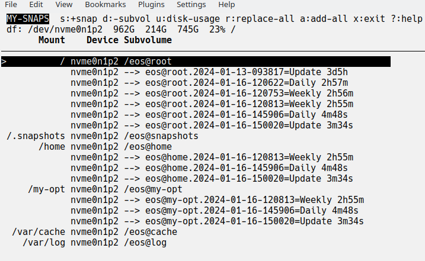
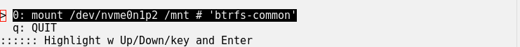
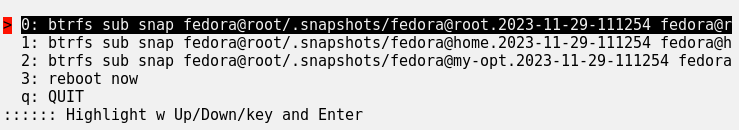

> **Minimal Quick Start:**
> * On python 3.11+, install `pipx`, else `pip`, and per your distro.
> * With `pipx`, run `pipx upgrade my-snaps || pipx install my-snaps`
> * With `pip`, run `pip install --upgrade my-snaps --user`
> * If `~/.local/bin/` is not on your $PATH, then make it so.
> * Run `my-snaps`; for each subvolume that you wish to snapshot, create a snapshot with `=Update` suffix (and as many as you wish to keep normally).
> * Subsequently before updates, run `my-snaps` and type `r` (replace-all) to replace the eldest `=Update` snaps per subvolume with new snaps.
> * For regular balancing, run `bt-smart-balance -i` once to install `anacron` job.

# my-snaps - Simple Tools for BTRFS snapshots
* `my-snaps`  assists creating snapshots and replacing the snapshots for the simplest BTRFS use cases (e.g., just before software updates).
* `my-restore` assists restoring snapshots to back out changes to the system
* `bt-smart-balance` is meant to be run regularly (say weekly) to keep your BTRFS balanced.
  Although bundled with `my-snaps`, it is unrelated to snapshots, per se.

**Prerequisites.** To use these tools, you must have an appropriate BTRFS setup:
* Your mounted top-level subvolume names must not contain '.' (i.e., periods).
* Your snapshot names must be one of the forms:
  * `{subvolume}.{date-string}`
  * `{subvolume}.{date-string}={label}`
* Your snapshots must reside in a top-level subvolume ending with "snapshots"; and it must normally be mounted at `/.snapshots`
* Labels define sets of snapshots that independently managed.
  * **note**: you cannot use the characters "." or "/" in the snapshot names and labels
  * Suggested labels:
    * **=Update** - created prior to a system update
    * **=Daily** - scheduled daily snapshots (and similarly for other periods)

Here is a compliant BTRFS setup showing it subvolumes/snapshots:
```
top-levels: eos@cache  eos@home  eos@log  eos@my-opt  eos@root  eos@snapshots

eos@snapshots:
'eos@home.2024-01-13-093817=Update'    'eos@root.2024-01-10-174732=Update'
'eos@home.2024-01-14-085102=Daily'     'eos@root.2024-01-13-084102=Daily'
'eos@home.2024-01-15-201554=Update'    'eos@root.2024-01-13-093817=Update'
'eos@my-opt.2024-01-13-093817=Update'  'eos@root.2024-01-14-085102=Daily'
'eos@my-opt.2024-01-14-085102=Daily'
```

**Installation.**
See the Quick Start. After install, run some tests per "Initial and Regression Testing"

---

## my-snaps
`my-snaps` can be used for simple snapshot maintenance. After running, it may look like this:


<!---  -->

* In the header, the BTRFS partitions are shown with `df -h` info (showing Size, Used, Avail, Use%, and Mounted on); run df separately to remind you of the fields when needed.
* On your very first run, highlight each subvolume for which you wish snapshots, and press `s` to create one (use one of your standard labels)
* `r` replaces your eldest snapshot of the same label for each top-level subvolume that has any snapshots.
* `a` replaces a snapshot of the same label for each top-level subvolume that has any snapshots.
  * to describe snapshots, add a short label when prompted (e.g., "=Update").
* `d`: to remove highlighted subvolume (usually pick a snapshot); you cannot remove mounted subvolumes; if there are nested subvolumes, those are removed too.
* `u`: to get disk usage (this can take quite a while and is not perfect)
* `?`: to get help on all keys and navigation

**NOTE**: actions often require confirmation to ensure accidental keystrokes do not clobber your system.

**Non-interactive use**: `my-snaps` can be run non-interactively with these options:
* `-p` or `--print` dumps your top-level subvolumes and their snapshots
* `-s{N}` or `--add-snap-max={N}` adds a new snapshot for each subvolume with snapshots and removes the eldest until there are no more than `{N}`.
* `-l{label}` or `--label={label}` to set the label of the snapshots involved.
* `--cron={period}` adds an `anacron` job to add snapshots at the given period with appropriate defaulted `-s` and `-L` or you can specify those. Notes:
  * `anacron` must be installed ... it is usually bundled in of a `cron` package such as `cronie`.
  * jobs are stored in `/etc/cron.{period}/{period}.snaps`. To change jobs settings, edit those or just reinstall with new options.
  * each time the job is run, its output goes to `/tmp/.my-snaps-{period}.txt`
  * removal of the `anacron` jobs is done manually

---

## my-restore
`my-restore` is used to restore one or more of your snapshots. When launched, you see something like this:


<!---  --->

Choose the desired BTRFS partition to mount on `/mnt` (after running `umount /mnt` if occupied).

Next you'll see a screen like this:


<!---  --->

* Highlight and press enter on the desired choice to effect the given action:
  * **restore**: promotes the snapshot to current
  * **revert**: moves the reversion back to current
  * **del**: deletes the reversion; **note**: delay deletion until a restore passes muster.
* when done with restores, reboot the system.
* to verify what would be done when choosing an action, you can put the tool in "dry-run" mode.

**Theory**: To restore a snapshot of the subvolume called "{subv}":
* normally, {subv} is renamed "{subv}.YYYY-MM-DD-HHMMSS=Reverted"; buf, if already reverted, {subv} simply removed, and
* secondly, a new, writable {subv} is created from the chosen read-only snapshot.


**------------- IMPORTANT NOTES -------------**

**When a restore is tested and deemed satisfactory then clean up.**
* To clean up, launch `my-snaps` or `my-restore` and delete "=Reverted" subvolumes.
* **Warning**: Failing to clean up will confuse the next `my-restore` and waste space.

**When a restore is tested and deemed unsatisfactory:**
* Launch `my-snaps` and adjust the restored snapshots as desired (e.g., restore a different snapshot or revert the reverted tip).
* Then reboot, test, and iterate until you are done and then clean up.

**In the case that an update or restore will not boot, then**:
* boot the live installer.
* install these tools per the instructions.
* use `my-restore` to return to a working system and reboot and eventually clean up the reverted subvolumes on the installed system.

---

## Initial and Regression Testing
Do not assume the BTRFS scripts work for you and then be in a pickle later. After install:
* Run `my-snaps` and ensure:
  * all the top-level subvolumes are showing, and
  * the expected snapshots are showing, and
  * add snapshots for the volumes you may wish to restore.

* If `my-snaps` is working, run `my-restore` and, after device selection, that the "restore" entries look right, and
* If all looks well, restore and then revert one of your subvolumes (returning all subvolumes as they were).

If there are issues, ensure snapshots are in a subvolume ending with `@snapshots` which is normally mounted at `/.snapshots`, and snapshots are named `{subvol}.{timespec}[=Label]` where `{timespec}` has only numbers, dashes and colons.

If you installed periodic snap scripts:
* test with `sudo run-parts --debug -v /etc/cron.daily` (or whichever directory)
* run `ls -ltr /tmp/.my-snaps-*` to check that it was run recently by looking at timestamps.

---

## Best Practices for Using this Simple Snapshot Strategy
* `my-snaps` and `my-restore` support the most simple BTRFS snapshot strategy (for update protection and limited file recovery).  To guard against huge catastrophes, add complementary strategies such as these so you can quickly reinstall if needed:
  * keep your important document it the cloud (e.g., Google Drive)
  * keep critical configuration on github (e.g., using [How to Store Dotfiles - A Bare Git Repository | Atlassian Git Tutorial](https://www.atlassian.com/git/tutorials/dotfiles) or a dotfile manager).
  * create a list or script of post-install tasks to add/remove apps (save with your dotfiles or in the cloud)
* BTW, the above complementary strategies have even more value if you have multiple installs (e.g., a desktop, a 24/7 server, and a few laptops all running similarly with the same apps an basic config).
* For more comprehensive protection, consider `snapper`, `btrbk`, `btrfsmaintenance`, and google for others.

---

## Special Behavior for BTRFS + Systemd-boot + pacman + dracut
In the titled circumstance, BTRFS snapshots of root will not boot. Something like:
> Booting a live installer, mounting the BTRFS subvols
> and /efi, and running `reinstall-kernels` is needed
> (plus some /efi cleanup).

To get around that, first setup a pacman hook to copy /efi to /.efi-back when the kernel is updated:
```
# place in /etc/pacman.d/hooks/95-efibackup_post.hook
[Trigger]
Operation = Upgrade
Operation = Install
Operation = Remove
Type = Path
Target = usr/lib/modules/*/vmlinuz

[Action]
Depends = rsync
Description = Backing up post /efi...
When = PostTransaction
Exec = /usr/bin/bash -c 'rsync -a -H --del /efi/ /.efi-back/'
```
Then, when replacing the root subvolume, /efi will be restored from its /.efi-back if that directory exists.

-- 

## bt-smart-balance
```
bt-smart-balance [-h] [-a ALLOCATED_PCT_MIN] [-w WASTED_PCT_MIN] [-m MOUNT_POINT] [-i]

options:
  -h, --help            show this help message and exit
  -a ALLOCATED_PCT_MIN, --allocated-pct-min ALLOCATED_PCT_MIN
                        min allocated percent to balance [0<=val<=99]
  -w WASTED_PCT_MIN, --wasted-pct-min WASTED_PCT_MIN
                        min wasted percent to balance [0<=val<=99]
  -m MOUNT_POINT, --mount-point MOUNT_POINT
                        BTRFS mount point
  -i, --install-anacron-job
                        creates a script in /etc/cron.weekly with current args

```
`bt-smart-balance` starts a BTRFS balance if the wasted% or allocated% is over
the given thresholds. It can be run manually, but suggested use is to manually run
it only once with the `-i` option to install it as a weekly `anacron` job.
To change balance criteria, re-run with new options.

To decide to balance, it runs `sudo btrfs filesystem usage /` and calculates
* ALLOCATED_PCT as allocated/size*100
* WASTED_PCT as (allocated-used)/size*100